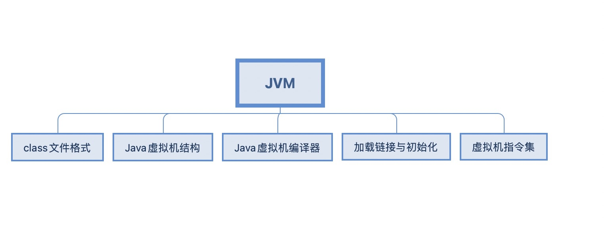
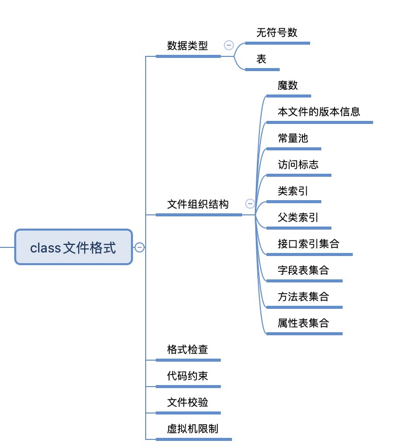
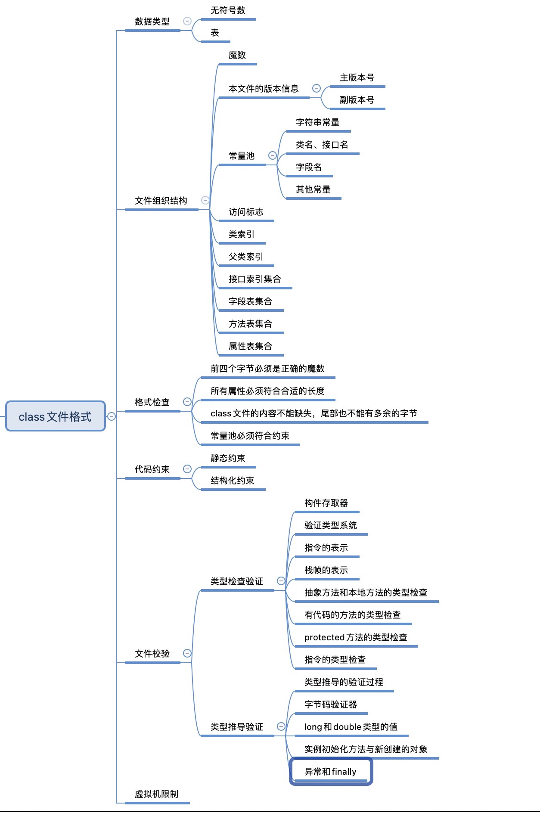
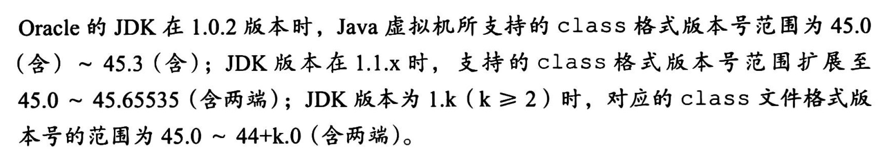
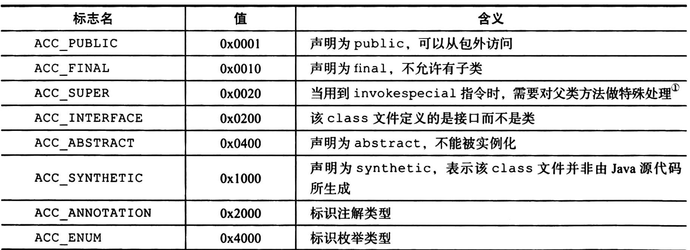
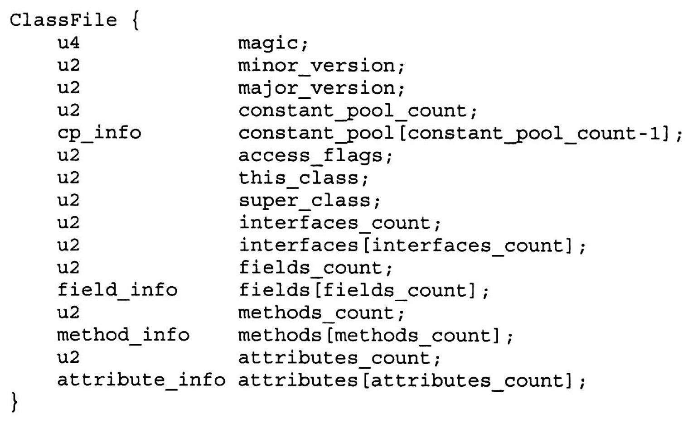

# jvm学习脉络

# class文件格式

* 类和接口不一定定义在文件里，也可以通过类加载器直接生成
* class文件是一组以8位字节为基础单位的二进制流，16位、32位、64位分别通过构造2个、4个、8个连续的8位字节来表示
* 必须严格按顺序存放，不能有间隔
* class文件格式采用一种类似于C语言结构体的伪结构来存储数据，这种伪结构中只有两种数据类型：无符号数和表。
* class文件中的数据要么是单个值，要么是二维表。
* 表的每一项长度不固定
* 可以使用`java.io.DataInput`、`java.io.DataInputStream`、`java.io.DataOutput`、`java.io.DataOutputStream`来访问这种格式的文件
## class文件的组织结构
    * 魔数    
    唯一作用是确保文件能被虚拟机接受，固定值不变，是 `oxCAFEBABE`
    * 本文件的版本信息    
    主版本号(major_version)和副版本号(minor_version)共同构成了class文件的版本号
    
    
    
    常见的jdk1.8的版本就是52.0,就是44+8.0来的
    
    * 常量池           
    主要保存字符串常量、类名、接口名、
    常量池以 `1~constant_pool_count-1` 为索引，第一个字节为类型标记，用于标记格式，称为tagbyte
    * 访问标志     
    
    
    
    由标志构成的掩码，用于表示类或者接口的访问权限
    * 类索引      
    必须是常量表的有效索引       
    CONSTANTS_Class_info结构体
    * 父类索引       
    必须是常量表的有效索引      
    0或者CONSTANT_Class_info结构体类型
    * 接口索引集合          
    0~interfaces_count
    * 字段表集合          
    field_info结构       
    * 方法表集合       
    method_info结构     
    * 属性表集合       
    attribute_info结构

## 格式检查

* 前四个字节必须是正确的魔数
* 所有属性必须符合合适的长度
* class文件的内容不能缺失，尾部也不能有多余的字节
* 常量池必须符合约束

## 代码约束

## 文件校验

## 虚拟机限制

# Java虚拟机结构

# Java虚拟机编译器

# 加载链接与初始化

# 虚拟机指令集

